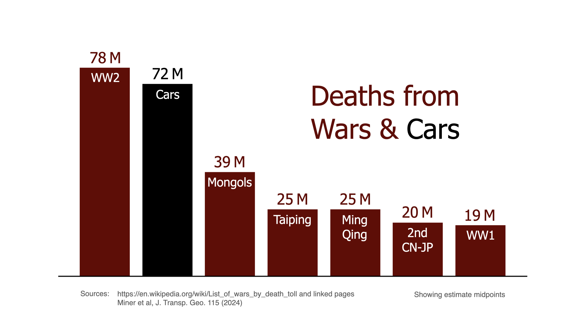
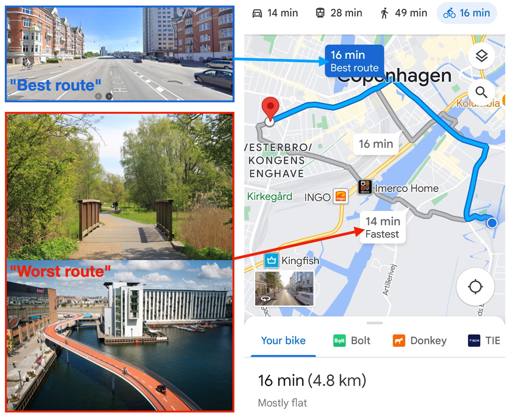
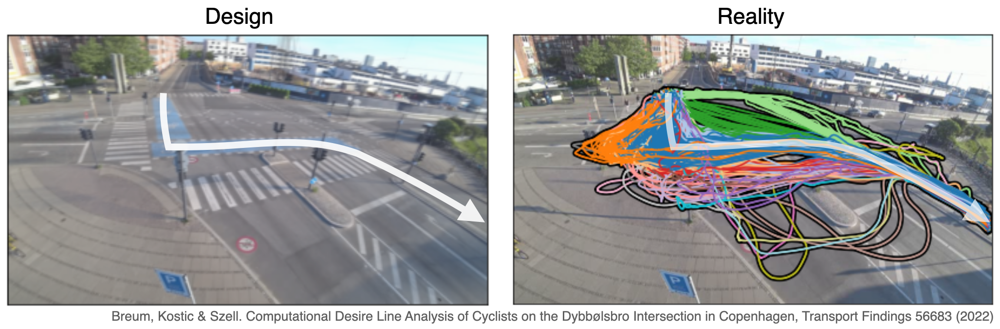
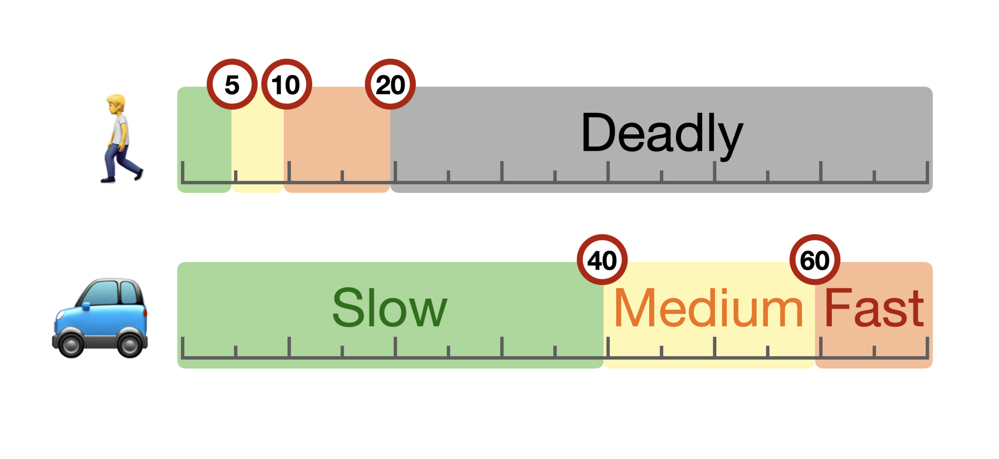
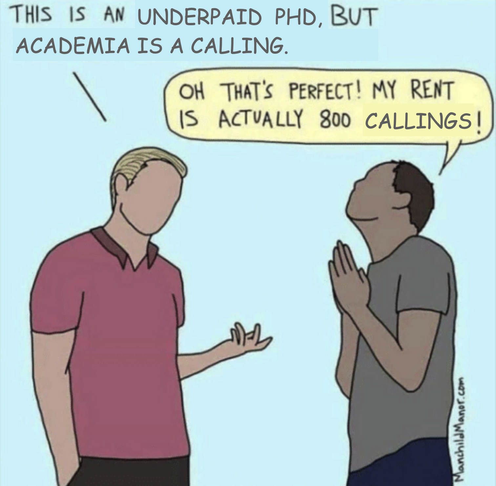
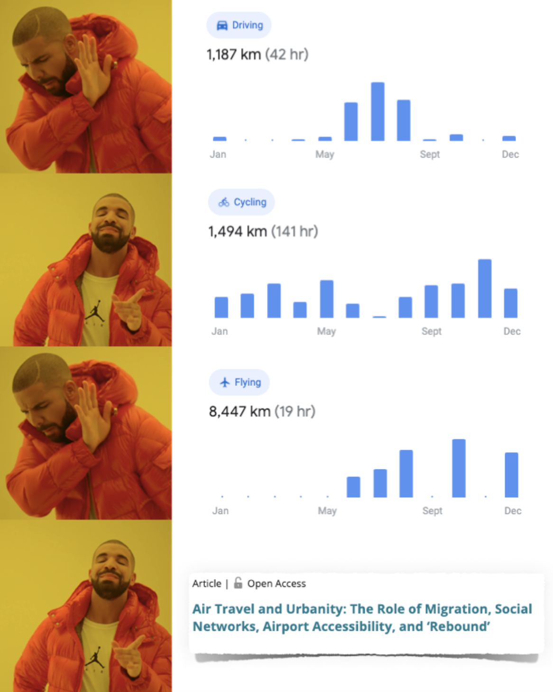
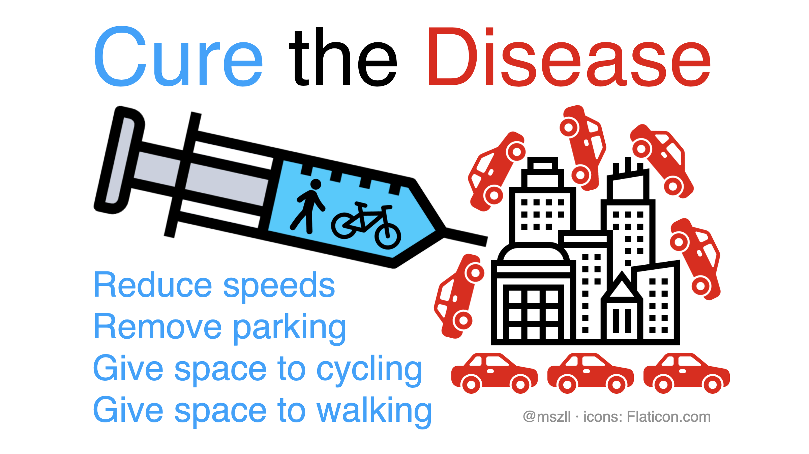
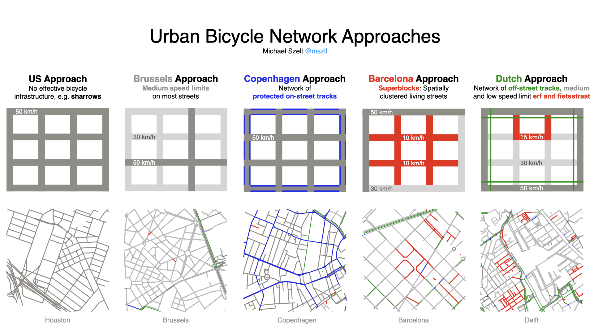
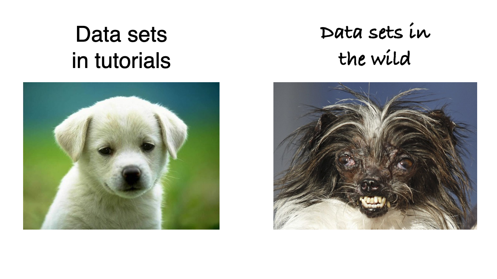

# Science Memes
This is a collection of science-inspired visual memes I have created. All images were created or postprocessed via keynote: [sciencememes.key](sciencememes.key)

## 2024-02: Deaths from Wars & Cars
Visualization of the largest death tolls from human wars compared to cars, inspired by the great paper [Car harm: A global review of automobility's harm to people and the environment](https://www.sciencedirect.com/science/article/pii/S0966692324000267). War death tolls are taken from wikipedia, the bar chart reports midpoints of estimates (for example, WW2 has 70-85M deaths, so (70+85)/2 ≈ 78). Thanks to Anastassia Vybornova for feedback.

## 2023-08: Google maps "car-brained" routing
Comparison of Google maps' suggested routes for cycling.

Between the choices:  
A - Fastest (14 min), Shortest (4.0 km), 30% green, 50% next to cars  
B - Slowest (16 min), Longest (4.8 km), 5% green, 95% next to cars

Google maps ranks route B "best" (1st), while route A is ranked worst (3rd).

## 2023-03: Implementing Car-Free Cities: Information Cycle
Beautification of Fig.11.2 from the book chapter [Implementing Car-Free Cities: Rationale, Requirements, Barriers and Facilitators](https://link.springer.com/chapter/10.1007/978-3-319-74983-9_11) by Nieuwenhuijsen et al. The figure caption reads "Information cycle related to support for change towards car-free cities".

.")

## 2023-01: Cyclist desire lines
A visualization of designed and actual paths for cyclists on a busy Danish intersection, following the paper [*Computational Desire Line Analysis of Cyclists on the Dybbølsbro Intersection in Copenhagen*](https://findingspress.org/article/56683-computational-desire-line-analysis-of-cyclists-on-the-dybbolsbro-intersection-in-copenhagen). Source: [https://github.com/SimonBreum/desirelines](https://github.com/SimonBreum/desirelines)

## 2022-12: Urban speeds
A sketch depicting two different perspectives of speed in the city. Numerical values are in km/h.

## 2022-10: PhD Calling
A popular visual meme created by manchildmanor.com, adapted to academia with the statement of an Ivy League Professor of how a PhD is not like real work with full pay but more of a calling.

## 2022-09: Alien test
A slide from a lecture on sustainable mobility, introducing the "alien test": If an alien visits earth and gets *completely* confused by your statement, then probably something is wrong with it.

 and new roads (64bn DKK). This is the alien test: If an alien visits earth and gets completely confused by your statement, then probably something is wrong with it.")

## 2022-01: Mobility report
Application of the popular Drake meme to my 2021 Google mobility report which shows a lot of cycling but also thousands of km of air travel, ending with the title of the paper [*Air Travel and Urbanity: The Role of Migration, Social Networks, Airport Accessibility, and ‘Rebound’*](https://www.cogitatiopress.com/urbanplanning/article/view/3983) which describes this phenomenon.

## 2021-09: Cure the disease
A provocative sketch depicting one of the biggest problems in cities and how to cure it.

## 2021-01: Bicycle network approaches
A visualization of the most distinct environments for cycling arriving from different approaches of urban planning, using real network data. Source: [https://github.com/mszell/taxonomybikenw](https://github.com/mszell/taxonomybikenw)

## 2020-12: Data sets
A funny slide used in teaching *Introduction to Data Science and Programming*. Source: [https://github.com/mszell/introdatasci](https://github.com/mszell/introdatasci)

